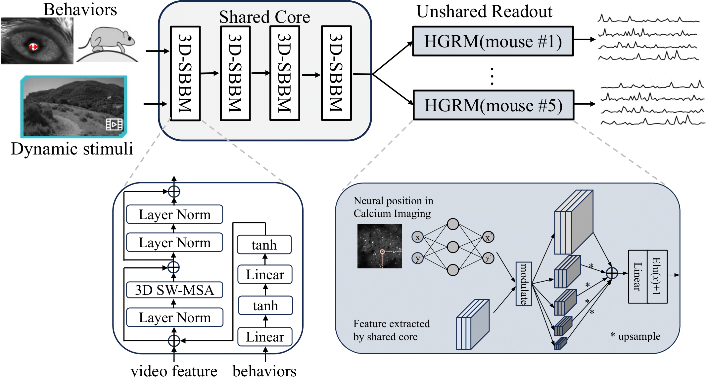

# Large-Scale Functional Modeling of Visual Cortex with Dynamic Stimuli [2nd solution in SENSORIUM 2023]

### **Dynamic-VFM**  
* Authors: Yu Zhu

## Model architecture
**Architecture.** Our model, Dynamic-V1FM (Dynamic V1 Functional Model), follows the pipeline proposed by Eric et al. [1,2] It incorporates a shared core module across mice and an unshared readout module for individual mice. The shared core module comprises 4 basic 3D-SBBM modules, based on the 3D swin transformer block [3] combined with a two-layer behavioral MLP (multi-layer perceptron) module [4]. Our readout module, Hierarchical Gaussian Readout Module (HGRM), extends the Gaussian readout [5] module by introducing a multi-layer design before the final linear readout.

**Ensemble Strategy.** As the readout module could support up to 5 levels of features, we traversed four combinations of low-resolution features, i.e., $C_{4}^{4}+C_{4}^{3}+C_{4}^{2}+C_{4}^{1}=15$ combinations, constructing the first 15 models. We also attempted to add feature enhancement modules to the low-resolution part of these 15 models, but the performance improvement was insignificant. As another set of 15 candidate models, we included them in the subsequent average ensemble strategy. We also trained a model with the original Gaussian readout module as a baseline. The aforementioned 31 models were trained based on a fixed random seed of 42, followed by an average ensemble of their predictions. For the final results of both competition tracks, the main track and the out-of-distribution track, we used the same model and ensemble strategy.



## Install and running
### Setup `torch` environment
```
conda env create -f environment.yml
```
Note: please restrictly follow this environment, otherwise the results can not be reproduced.


### Training
```
python train.py config/neuroencoding.py
```
Note: the training needs 8 2080Ti GPUs with the batch size 32, it would takes about 1-1.5days for single model training. We load all the data to the memory for speeding up training, which requires at least 256GB memory.

### Generate the submission results.
Please go to the folder ```submission_func```.

```
1. run each line in submission.ipynb
```
or 
```
# test submitted results.
python Ensemble_func_mainTrack.py
python Ensemble_func_OODTrack.py

# test each model's results in the above submitted results.
python single_model_mainTrack.py
python single_model_OODTrack.py
```
We provide [pretrained weight](https://drive.google.com/file/d/1-tNef-cT4qlihTw0G1jKib4PUyr3iBlE/view?usp=drive_link).

Note: the inference needs 8 2080Ti GPUs, it would takes about 2-3 hours for single model. 


### References
[1] Eric Y Wang, Paul G Fahey, Kayla Ponder, Zhuokun Ding, Andersen Chang, Taliah Muhammad, Saumil Patel, Zhiwei Ding, Dat Tran, Jiakun Fu, et al. Towards a foundation model of the mouse visual cortex. bioRxiv, 2023.

[2] Polina Turishcheva, Paul G Fahey, Laura Hansel, Rachel Froebe, Kayla Ponder, Michaela Vystrˇcilová, Konstantin F Willeke, Mohammad Bashiri, Eric Wang, Zhiwei Ding, et al. The dynamic sensorium competition for predicting large-scale mouse visual cortex activity from videos. ArXiv, 2023. 

[3] Ze Liu, Jia Ning, Yue Cao, Yixuan Wei, Zheng Zhang, Stephen Lin, and Han Hu. Video swin transformer. In Proceedings of the IEEE/CVF conference on computer vision and pattern recognition, pages 3202–3211, 2022. 

[4] Bryan M Li, Isabel M Cornacchia, Nathalie L Rochefort, and Arno Onken. V1t: large-scale mouse v1 response prediction using a vision transformer. arXiv preprint arXiv:2302.03023, 2023. 

[5] Konstantin-Klemens Lurz, Mohammad Bashiri, Konstantin Willeke, Akshay K Jagadish, Eric Wang, Edgar Y Walker, Santiago A Cadena, Taliah Muhammad, Erick Cobos, Andreas S Tolias, et al. Generalization in data-driven models of primary visual cortex. BioRxiv, pages 2020–10, 2020. 